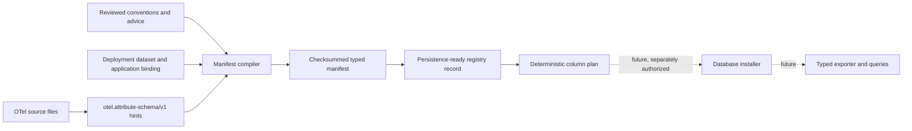

# Typed attribute manifests

OpenTelemetry attributes keep their real values in the SDK, but ClickStack's
compatible attribute maps store text. Text maps are useful for broad search and
compatibility; they are awkward for numeric filters and aggregates. Frequently
queried attributes can eventually be copied into dedicated typed columns while
the existing text entry remains available.

This release provides two safe building blocks: a pure manifest compiler and a
persistence-ready registry lifecycle/planner for span attributes. Neither
connects to chDB, runs DDL, inspects stored telemetry, or changes exporter rows.



## Compile a manifest

The deployment supplies the dataset and application identity. These values are
trusted configuration; an OTel `schemaUrl`, attribute value, or runtime
observation cannot choose them.

```clojure
(require '[otel.exporter.chdb.attribute-manifest :as manifest])

(def compiled
  (manifest/compile-manifest
   {:dataset-id "telemetry-prod"
    :application-id "checkout"
    :lineage "checkout-v1"
    :version 1
    :fragments
    [{:schema manifest/reviewed-fragment-schema
      :authority :advice
      :source "instrumentation/checkout.edn"
      :entries
      [{:location :span-attributes
        :key "checkout.remaining_items"
        :type :int64}
       {:location :span-attributes
        :key "checkout.complete"
        :type :boolean}]}]}))

(spit "target/checkout-attributes.edn" (manifest/render compiled))
```

The first format accepts three promoted types: `:string`, `:boolean`, and
`:int64`. They map only to the library-owned ClickHouse types `String`, `Bool`,
and `Int64`. Callers cannot supply SQL, codecs, column names, or type
expressions.

Reviewed fragments use one of three authorities:

- `:semantic-convention` for a pinned convention registry;
- `:advice` for an instrumentation or advice pack;
- `:runtime-reviewed` for an observation that an operator has explicitly
  reviewed and converted into configuration.

The supported locations are span, resource, scope, log, and metric-point
attributes. Source-inferred fragments currently cover the locations emitted by
`otel.attribute-schema/v1`; reviewed fragments can describe scope attributes as
well.

## Determinism and conflicts

Fragment, map, and entry traversal order cannot change the result. Identical
declarations merge their provenance. Different reviewed types for the same
location and key fail compilation; `:int64` is never widened to `:double`.

Every field identity includes the dataset, application, lineage, version,
location, key, and type. Its value and status column names contain a bounded
readable prefix plus a digest suffix, so two keys that sanitize to the same text
still receive different identifiers. The manifest checksum is SHA-256 over its
canonical EDN payload without the checksum field. Rendering adds one final
newline and no timestamp or checkout path.

Inference is evidence, not permission. Unknown expressions, invalid literals,
conflicting types, unsupported values, and dynamic keys become explicit
diagnostics and do not produce fields. A reviewed fragment may promote a safe
declaration separately; inference cannot silently override it.

## Prepare and reconcile a registry record

The registry API turns an approved manifest into a record that the included
catalog store can persist. The store uses the jolt-chDB Durable object-backend
contract, so the same code can target a suitably scoped local or S3 backend.
It treats the provider ETag as opaque and compare-and-sets the complete catalog;
the record `:generation` is an additional checked lifecycle fence.

The namespace exports Malli schemas for the registry record, generation,
failure, observed-schema, and add-column operation envelopes. Malli owns the
closed structural contract and can feed Hegel generators; checksum authority,
catalog collisions, lifecycle transitions, and physical reconciliation remain
explicit functions because they relate more than one value or state.

```clojure
(require '[otel.exporter.chdb.attribute-registry :as registry])
(require '[otel.exporter.chdb.attribute-registry-store :as registry-store])

(def snapshot (registry-store/load! object-backend))
(def persisted-records (get-in snapshot [:catalog :records]))
(def preparing (registry/prepare compiled persisted-records))
(def prepared-write
  (registry-store/commit-record! object-backend snapshot preparing))
(def first-pass (registry/reconcile preparing
                                    (:generation preparing)
                                    observed-column-types))

;; Persist :preparing before executing these through a separately authorized
;; installer. Reload after each commit; do not reuse an old snapshot.
(:operations first-pass)
;; => [{:op :add-column, :table "otel_traces", ...}]
```

The store owns one canonical EDN object at
`otel/typed-attribute-registry-v1.edn`. Pass an object-scoped backend when
multiple deployments share a provider namespace. Each successful catalog
change increments a bounded catalog revision. Existing records can advance by
exactly one generation, new records start at generation one, and records are
retired rather than deleted. Repeating an identical commit is a no-op.

A provider timeout does not imply success or failure. On an ambiguous create or
replace, the store rereads and validates the canonical wire document. It
reports success only when that document equals the intended catalog. Otherwise
it reports an ambiguous commit; the caller must reload and reconcile instead of
blindly replaying an old snapshot. A definite competing write reports a stale
snapshot.

The lifecycle is `:preparing`, `:active`, `:failed`, or `:retired`. Missing
columns keep the record preparing and produce sorted, idempotent operation data.
An existing column with the wrong type moves it to failed without producing an
operation. A corrected schema can retry through preparing and becomes active
only after every expected value and status column is observed with its exact
type. Retired records cannot reactivate. Repeating the same observation is
idempotent, and stale generations fail before a transition.

The catalog supplied to `prepare` must include every registry record targeting
the same physical table. Collision checks intentionally do not stop at a
logical `dataset-id`: field identities include that dataset, but physical
column ownership is enforced across the whole catalog so a truncated-digest
collision cannot hide behind two deployment labels.

An installer must reconcile persisted records against the physical schema on
every startup before exposing active descriptors to a query or export consumer.
Loading a previously active record alone is not proof that an operator has not
changed the table since the prior process exited.

The crash-recovery sequence is deliberately small: persist `:preparing`, apply
the returned idempotent data operations through a separately authorized DDL
adapter, observe the real schema, reconcile, and CAS-persist the resulting
record. A crash at any cut restarts from the persisted catalog and the observed
schema. The store never renders SQL and telemetry never supplies an authority
or lifecycle state.

The span-only installer owns that sequence. Calling `install-approved!` is an
operator/deployment action: do not expose it to telemetry input. Its runtime is
a closed map of explicit effects, which keeps authorization and database access
at the application boundary:

```clojure
(require '[jdbc.core :as jdbc])
(require '[otel.exporter.chdb.attribute-registry-installer :as installer])

(installer/install-approved!
 object-backend
 compiled
 {:execute-ddl! #(jdbc/execute! connection %)
  :observe-columns
  #(into {}
         (map (juxt :name :type))
         (jdbc/fetch connection "DESCRIBE TABLE otel_traces"))})
```

The installer renders only `ALTER TABLE otel_traces ADD COLUMN IF NOT EXISTS`
for an operation that exactly matches the approved record. Table, identifier,
and closed ClickHouse type come from the library-owned descriptor; callers
cannot append SQL. It persists preparing before the first statement, observes
again after applying missing columns, and CAS-persists active or failed before
returning. A failed or still-preparing result has an empty `:descriptors`
vector. Even a loaded active record is freshly observed and its current catalog
snapshot confirmed before descriptors are returned.

Fresh observation can discover that a formerly active or failed record needs
repair. In that case reconciliation creates a new preparing generation and the
installer CAS-persists that exact generation before the first repair statement.
The persisted preparing record and its returned snapshot then authorize both
DDL and the final reconciliation. If that intermediate CAS is stale, no DDL is
executed; after a crash, retry recovers from preparing rather than trusting the
older active or failed state.

### Installer trace and model boundary

An optional `:emit!` effect receives the closed event sequence
`:snapshot-loaded`, `:record-persisted`, `:schema-observed`, `:ddl-started`,
`:ddl-applied`, and `:descriptors-published`. These events contain no clock or
telemetry payload and make deterministic crash-cut traces available to Hegel or
a model adapter. `:record-persisted` is emitted only after the catalog CAS is
confirmed; `:descriptors-published` is emitted afterward.

A future state-machine model should use catalog value/ETag, physical column
map, installer phase, intended record generation, and published descriptor
generation as state. Its actions are load, prepare-CAS, observe, plan,
execute-one, observe-after-DDL, final-CAS, publish, competing-CAS, and crash. The
central safety invariant is: every publication is justified by a confirmed
persisted active generation and all of its columns matched a fresh observation
in that attempt. A fair-retry liveness property should show convergence after
any crash when additive execution eventually succeeds and no competing writer
wins forever. Running that model is intentionally deferred while the existing
exhaustive Durable check owns machine resources.

Each value column reserves a `UInt8` status column with stable meanings for
historical-untyped, absent, present-empty, valid, and invalid. Exporting those
statuses is a later ingestion slice; reserving them now prevents nullable data
from becoming an ambiguous contract.

This first registry seam intentionally accepts only `:span-attributes`, which
map unambiguously to `otel_traces`. Resource and scope attributes occur on more
than one signal table. Their manifest identity needs a signal/table dimension
before this planner can support them without installing a projection on the
wrong table.

## What remains

Only an installer-returned active descriptor should become queryable. Export
still needs to populate the reserved per-row statuses and typed values, consume
those descriptors without bypassing installation, and prove direct-export and
OTLP-receiver equivalence. The injectable installer is covered at deterministic
crash cuts, but the state-machine model above and a native chDB integration gate
remain. The current process-local fresh observation can also be invalidated by
an out-of-band DDL change immediately after it returns; deployments requiring a
stronger invariant need database-side ownership or a shared schema lease. A
later catalog writer can likewise supersede a returned generation, so consumers
must retain the result's record/snapshot identity rather than treating the bare
descriptor vector as an eternal capability.
