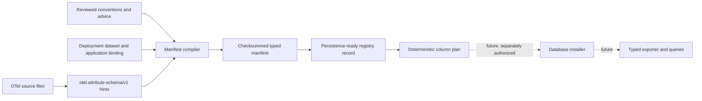

# Typed attribute manifests

OpenTelemetry attributes keep their real values in the SDK, but ClickStack's
compatible attribute maps store text. Text maps are useful for broad search and
compatibility; they are awkward for numeric filters and aggregates. Frequently
queried attributes can eventually be copied into dedicated typed columns while
the existing text entry remains available.

This release provides two safe building blocks: a pure manifest compiler and a
persistence-ready registry lifecycle/planner for span attributes. Neither
connects to chDB, runs DDL, inspects stored telemetry, or changes exporter rows.



## Compile a manifest

The deployment supplies the dataset and application identity. These values are
trusted configuration; an OTel `schemaUrl`, attribute value, or runtime
observation cannot choose them.

```clojure
(require '[otel.exporter.chdb.attribute-manifest :as manifest])

(def compiled
  (manifest/compile-manifest
   {:dataset-id "telemetry-prod"
    :application-id "checkout"
    :lineage "checkout-v1"
    :version 1
    :fragments
    [{:schema manifest/reviewed-fragment-schema
      :authority :advice
      :source "instrumentation/checkout.edn"
      :entries
      [{:location :span-attributes
        :key "checkout.remaining_items"
        :type :int64}
       {:location :span-attributes
        :key "checkout.complete"
        :type :boolean}]}]}))

(spit "target/checkout-attributes.edn" (manifest/render compiled))
```

The first format accepts three promoted types: `:string`, `:boolean`, and
`:int64`. They map only to the library-owned ClickHouse types `String`, `Bool`,
and `Int64`. Callers cannot supply SQL, codecs, column names, or type
expressions.

Reviewed fragments use one of three authorities:

- `:semantic-convention` for a pinned convention registry;
- `:advice` for an instrumentation or advice pack;
- `:runtime-reviewed` for an observation that an operator has explicitly
  reviewed and converted into configuration.

The supported locations are span, resource, scope, log, and metric-point
attributes. Source-inferred fragments currently cover the locations emitted by
`otel.attribute-schema/v1`; reviewed fragments can describe scope attributes as
well.

## Determinism and conflicts

Fragment, map, and entry traversal order cannot change the result. Identical
declarations merge their provenance. Different reviewed types for the same
location and key fail compilation; `:int64` is never widened to `:double`.

Every field identity includes the dataset, application, lineage, version,
location, key, and type. Its value and status column names contain a bounded
readable prefix plus a digest suffix, so two keys that sanitize to the same text
still receive different identifiers. The manifest checksum is SHA-256 over its
canonical EDN payload without the checksum field. Rendering adds one final
newline and no timestamp or checkout path.

Inference is evidence, not permission. Unknown expressions, invalid literals,
conflicting types, unsupported values, and dynamic keys become explicit
diagnostics and do not produce fields. A reviewed fragment may promote a safe
declaration separately; inference cannot silently override it.

## Prepare and reconcile a registry record

The registry API turns an approved manifest into a record that a deployment
store can persist. The store, not this library, must compare-and-set the record
at its `:generation` before applying an operation plan.

```clojure
(require '[otel.exporter.chdb.attribute-registry :as registry])

(def preparing (registry/prepare compiled persisted-records))
(def first-pass (registry/reconcile preparing
                                    (:generation preparing)
                                    observed-column-types))

;; Persist (:record first-pass) with a generation CAS before executing these.
(:operations first-pass)
;; => [{:op :add-column, :table "otel_traces", ...}]
```

The lifecycle is `:preparing`, `:active`, `:failed`, or `:retired`. Missing
columns keep the record preparing and produce sorted, idempotent operation data.
An existing column with the wrong type moves it to failed without producing an
operation. A corrected schema can retry through preparing and becomes active
only after every expected value and status column is observed with its exact
type. Retired records cannot reactivate. Repeating the same observation is
idempotent, and stale generations fail before a transition.

An installer must reconcile persisted records against the physical schema on
every startup before exposing active descriptors to a query or export consumer.
Loading a previously active record alone is not proof that an operator has not
changed the table since the prior process exited.

Each value column reserves a `UInt8` status column with stable meanings for
historical-untyped, absent, present-empty, valid, and invalid. Exporting those
statuses is a later ingestion slice; reserving them now prevents nullable data
from becoming an ambiguous contract.

This first registry seam intentionally accepts only `:span-attributes`, which
map unambiguously to `otel_traces`. Resource and scope attributes occur on more
than one signal table. Their manifest identity needs a signal/table dimension
before this planner can support them without installing a projection on the
wrong table.

## What remains

A later slice will supply the compare-and-set registry store and execute these
plans through crash-safe, idempotent DDL. Only a persisted active descriptor
should become queryable. Export still needs to populate the reserved per-row
statuses and typed values, reconcile interrupted DDL at every cut, and prove
direct-export and OTLP-receiver equivalence. None of those database or ingestion
claims are made by this storage-independent planner.
