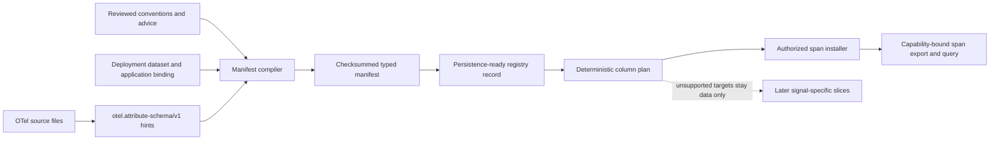

# Typed attribute manifests

OpenTelemetry attributes keep their real values in the SDK, but ClickStack's
compatible attribute maps store text. Text maps are useful for broad search and
compatibility; they are awkward for numeric filters and aggregates. Frequently
queried attributes can eventually be copied into dedicated typed columns while
the existing text entry remains available.

The manifest format is storage-independent and the current installer/exporter
path supports span attributes on `otel_traces`. Every reviewed declaration now
names a closed signal, physical table, and attribute location before it can
influence a checksum, field identifier, registry plan, or capability consumer.



## Compile a manifest

The deployment supplies the dataset and application identity. These values are
trusted configuration; an OTel `schemaUrl`, attribute value, or runtime
observation cannot choose them.

```clojure
(require '[otel.exporter.chdb.attribute-manifest :as manifest])

(def compiled
  (manifest/compile-manifest
   {:dataset-id "telemetry-prod"
    :application-id "checkout"
    :lineage "checkout-v1"
    :version 1
    :fragments
    [{:schema manifest/reviewed-fragment-schema
      :authority :advice
      :source "instrumentation/checkout.edn"
      :entries
      [{:signal :spans
        :table "otel_traces"
        :location :span-attributes
        :key "checkout.remaining_items"
        :type :int64}
       {:signal :spans
        :table "otel_traces"
        :location :span-attributes
        :key "checkout.complete"
        :type :boolean}]}]}))

(spit "target/checkout-attributes.edn" (manifest/render compiled))
```

The v2 format accepts three promoted types: `:string`, `:boolean`, and
`:int64`. They map only to the library-owned ClickHouse types `String`, `Bool`,
and `Int64`. Callers cannot supply SQL, codecs, column names, or type
expressions.

Reviewed fragments use one of three authorities:

- `:semantic-convention` for a pinned convention registry;
- `:advice` for an instrumentation or advice pack;
- `:runtime-reviewed` for an observation that an operator has explicitly
  reviewed and converted into configuration.

The closed signals are `:spans`, `:logs`, and `:metrics`. Each declaration also
names one compatible library-known table: `otel_traces`, `otel_logs`, or one of
the gauge, sum, and histogram metric tables. The valid location depends on the
signal. Span/log/metric-specific attributes are accepted only on their signal;
resource and scope attributes are valid on each signal but remain distinct
because signal and table are part of their identity.

Source inference promotes only targets it can identify without guessing. Span
and log attribute calls have one table. Standalone resource inference does not
say which consuming signal owns the resource, and metric inference does not say
which metric-kind table owns the point, so those hints remain
`:ambiguous-target` diagnostics until reviewed configuration supplies the exact
target.

## Determinism and conflicts

Fragment, map, and entry traversal order cannot change the result. Identical
declarations merge their provenance. Different reviewed types for the same
signal, table, location, and key fail compilation; the same key may deliberately
have different types on disjoint signals. `:int64` is never widened to
`:double`.

Every field identity includes the dataset, application, lineage, deployment
version, signal, table, location, key, and type. Its value and status column
names contain a bounded readable target prefix plus a digest suffix, so two keys
that sanitize to the same text still receive different identifiers. The
manifest checksum is SHA-256 over its canonical EDN payload without the
checksum field. Rendering adds one final newline and no timestamp or checkout
path.

### Migrating v1 manifests

Manifest and reviewed-fragment canonicalization is now explicitly v2. A v1
field did not record a signal or table, so this library will not guess a target
or preserve its old digest. `validate-manifest` reports `:legacy-manifest`, and
v1 reviewed fragments report `:legacy-reviewed-fragment`. This also makes a
catalog containing a persisted v1 manifest fail closed when loaded.

Migration is an operator review step: retain or archive the v1 catalog for
audit, add `:signal` and `:table` to every reviewed entry, choose a new manifest
deployment `:version`, compile it as v2, and install it against a fresh
registry-object prefix. The resulting field IDs and physical columns are new by
design. There is no automatic location-to-signal conversion because resource,
scope, and metric targets can be ambiguous.

Inference is evidence, not permission. Unknown expressions, invalid literals,
conflicting types, unsupported values, and dynamic keys become explicit
diagnostics and do not produce fields. A reviewed fragment may promote a safe
declaration separately; inference cannot silently override it.

## Prepare and reconcile a registry record

The registry API turns an approved manifest into a record that the included
catalog store can persist. The store uses the jolt-chDB Durable object-backend
contract, so the same code can target a suitably scoped local or S3 backend.
It treats the provider ETag as opaque and compare-and-sets the complete catalog;
the record `:generation` is an additional checked lifecycle fence.

The namespace exports Malli schemas for the registry record, generation,
failure, observed-schema, and add-column operation envelopes. Malli owns the
closed structural contract and can feed Hegel generators; checksum authority,
catalog collisions, lifecycle transitions, and physical reconciliation remain
explicit functions because they relate more than one value or state.

```clojure
(require '[otel.exporter.chdb.attribute-registry :as registry])
(require '[otel.exporter.chdb.attribute-registry-store :as registry-store])

(def snapshot (registry-store/load! object-backend))
(def persisted-records (get-in snapshot [:catalog :records]))
(def preparing (registry/prepare compiled persisted-records))
(def prepared-write
  (registry-store/commit-record! object-backend snapshot preparing))
(def first-pass (registry/reconcile preparing
                                    (:generation preparing)
                                    [{:signal :spans
                                      :table "otel_traces"
                                      :columns observed-column-types}]))

;; Persist :preparing before executing these through a separately authorized
;; installer. Reload after each commit; do not reuse an old snapshot.
(:operations first-pass)
;; => [{:op :add-column, :table "otel_traces", ...}]
```

The store owns one canonical EDN object at
`otel/typed-attribute-registry-v1.edn`. Pass an object-scoped backend when
multiple deployments share a provider namespace. Each successful catalog
change increments a bounded catalog revision. Existing records can advance by
exactly one generation, new records start at generation one, and records are
retired rather than deleted. Repeating an identical commit is a no-op.

A provider timeout does not imply success or failure. On an ambiguous create or
replace, the store rereads and validates the canonical wire document. It
reports success only when that document equals the intended catalog. Otherwise
it reports an ambiguous commit; the caller must reload and reconcile instead of
blindly replaying an old snapshot. A definite competing write reports a stale
snapshot.

The lifecycle is `:preparing`, `:active`, `:failed`, or `:retired`. Physical
evidence is a bounded vector of closed `:signal`, `:table`, and `:columns`
envelopes. Signal/table pairs come from `attribute-identity`; unknown,
cross-signal, duplicate, or missing target-table envelopes fail before planning.
Only columns in the record's exact table participate in reconciliation. Missing
columns keep the record preparing and produce sorted, idempotent operation data.
An existing column with the wrong type moves it to failed without producing an
operation. A corrected schema can retry through preparing and becomes active
only after every expected value and status column is observed with its exact
type. Retired records cannot reactivate. Repeating the same observation is
idempotent, and stale generations fail before a transition.

The catalog supplied to `prepare` must include every registry record targeting
the same physical table. Collision checks intentionally do not stop at a
logical `dataset-id`: field identities include that dataset, but physical
column ownership is enforced across the whole catalog so a truncated-digest
collision cannot hide behind two deployment labels.

An installer must reconcile persisted records against the physical schema on
every startup before exposing active descriptors to a query or export consumer.
Loading a previously active record alone is not proof that an operator has not
changed the table since the prior process exited.

The crash-recovery sequence is deliberately small: persist `:preparing`, apply
the returned idempotent data operations through a separately authorized DDL
adapter, observe the real schema, reconcile, and CAS-persist the resulting
record. A crash at any cut restarts from the persisted catalog and the observed
schema. The store never renders SQL and telemetry never supplies an authority
or lifecycle state.

The span-only installer owns that sequence. Calling `install-approved!` is an
operator/deployment action: do not expose it to telemetry input. Its runtime is
a closed map of explicit effects, which keeps authorization and database access
at the application boundary:

```clojure
(require '[jdbc.core :as jdbc])
(require '[otel.exporter.chdb.attribute-registry-installer :as installer])

(installer/install-approved!
 object-backend
 compiled
 {:target connection
  :execute-ddl! #(jdbc/execute! connection %)
  :observe-columns
  #(vector
    {:signal :spans
     :table "otel_traces"
     :columns
     (into {}
           (map (juxt :name :type))
           (jdbc/fetch connection "DESCRIBE TABLE otel_traces"))})})
```

The installer renders only `ALTER TABLE otel_traces ADD COLUMN IF NOT EXISTS`
for an operation that exactly matches the approved record. Table, identifier,
and closed ClickHouse type come from the library-owned descriptor; callers
cannot append SQL. It persists preparing before the first statement, observes
again after applying missing columns, and CAS-persists active or failed before
returning. A failed or still-preparing result has an empty `:descriptors`
vector. Even a loaded active record is freshly observed and its current catalog
snapshot confirmed before descriptors are returned.

Fresh observation can discover that a formerly active or failed record needs
repair. In that case reconciliation creates a new preparing generation and the
installer CAS-persists that exact generation before the first repair statement.
The persisted preparing record and its returned snapshot then authorize both
DDL and the final reconciliation. If that intermediate CAS is stale, no DDL is
executed; after a crash, retry recovers from preparing rather than trusting the
older active or failed state.

### Installer trace and model boundary

An optional `:emit!` effect receives the closed event sequence
`:snapshot-loaded`, `:record-persisted`, `:schema-observed`, `:ddl-started`,
`:ddl-applied`, and `:descriptors-published`. These events contain no clock or
telemetry payload and make deterministic crash-cut traces available to Hegel or
a model adapter. `:record-persisted` is emitted only after the catalog CAS is
confirmed; `:descriptors-published` is emitted afterward. Every
`:schema-observed` event carries the canonical record-owned `:signal` and
`:table`; invalid or wrong-table evidence is rejected before that event.

A future state-machine model should use catalog value/ETag, a table-qualified
physical column map, installer phase, intended record generation, and published
descriptor generation as state. Its actions are load, prepare-CAS, observe, plan,
execute-one, observe-after-DDL, final-CAS, publish, competing-CAS, and crash. The
central safety invariant is: every publication is justified by a confirmed
persisted active generation and all of its columns matched a fresh observation
in that attempt. A fair-retry liveness property should show convergence after
any crash when additive execution eventually succeeds and no competing writer
wins forever. This slice deliberately defers changing or running that joined
model to the subsequent model/trace issue. Its executable bridge assumption is
now explicit: one install attempt has exactly one manifest-owned target, a
schema-observed event names that target, and reconciliation requires a fresh
envelope for that exact table. Pure reconciliation tests exercise all five
closed tables; only the span target reaches DDL. Running the future model is
intentionally deferred while the existing exhaustive Durable check owns machine
resources.

Each value column reserves a `UInt8` status column with stable meanings for
historical-untyped, absent, present-empty, valid, and invalid. The current span
exporter writes those statuses; reserving them in the shared plan prevents later
signal-specific ingestion from inventing an ambiguous nullable contract.

The manifest now carries the prerequisite signal/table identity, but this first
physical registry seam still accepts only the exact target
`{:signal :spans, :table "otel_traces", :location :span-attributes}`. Other
valid targets compile into storage-independent plans and distinct field IDs,
then fail with
`:unsupported-target` if passed to `registry/prepare`. Later ingestion/query
slices must implement their signal-specific row and table semantics before that
allowlist expands.

## Export confirmed typed span values

An active installer result includes an opaque, process-local `:descriptor-set`.
This is the only typed-schema input accepted by the exporter; a bare descriptor
vector, loaded active record, manifest, or telemetry payload cannot substitute
for installation confirmation.

```clojure
(def installation
  (installer/install-approved! object-backend compiled installer-runtime))

(def exporter
  (otel.exporter.chdb/exporter
   {:connection connection
    :signals #{:spans}
    :typed-span-descriptors (:descriptor-set installation)}))
```

For each declared span attribute, export writes the library-owned value column
and its `UInt8` status. Exact strings, booleans, and signed 64-bit integers use
status `3` (`:valid`). Missing values use the ClickHouse type's default with
status `1` (`:absent`); an empty string uses status `2` (`:present-empty`); and
a wrong type, overflowing integer, or duplicate normalized key uses the safe
default with status `4` (`:invalid`). Rows exported without a capability omit
the additive columns, whose ClickHouse default status `0` means
`:historical-untyped`.

The original `SpanAttributes Map(String,String)` is always populated as before.
This preserves ClickStack compatibility, undeclared attributes, and a readable
fallback for invalid promoted values. Typed projection does not read the
catalog, observe schema, or execute DDL during export; it can only use the
capability minted after `install-approved!` completed. The capability represents
one confirmed startup generation. If another process changes the catalog or
physical schema, recreate installation/exporter state before relying on it.
The install runtime's required `:target` is normally that same connection. The
capability is identity-bound to it, and exporter construction rejects reuse with
another connection before processing any row.

Direct export and OTLP receiver ingestion share this exact exporter boundary.
The native gate installs one capability on one connection, writes a canonical
SDK-ended span directly, then sends the same span through OTLP JSON encoding,
real JSON parsing, and `otel.otlp.http-receiver/handler` into that same exporter.
The complete stored physical rows, including promoted values/statuses, generic
attributes, events, links, resource, and scope metadata, must be identical. The
receiver is a Ring boundary rather than a socket server; network transport and
authentication remain host-owned and outside this equivalence claim.

The descriptor-set class necessarily has a host-visible constructor, but its
value also carries a private identity issuer checked on every consumption.
Ordinary construction with copied record/snapshot/descriptors and a missing or
different issuer therefore fails. Deliberate same-process reflection or private
Var access is outside this trust boundary: code with that authority could also
invoke the database effects directly. Typed exporter configuration requires an
explicit `:connection`; a `:db-spec`-owned connection cannot be proven identical
to the target captured by installation.

## Query confirmed typed span values

The explorer consumes that same capability and exact connection identity for a
bounded top-values query:

```clojure
(explorer/typed-span-values
 connection
 (:descriptor-set installation)
 {:signal :spans
  :keys ["checkout.count" "checkout.complete"]
  :start-unix-nano window-start
  :end-unix-nano window-end
  :limit 20})
```

Every requested key must be unique and approved by the capability. The query
uses only `otel_traces` and the manifest-derived physical value/status columns;
the logical key, text bound, time window, and limit remain JDBC parameters.
Statuses `2` and `3` read the typed value. Historical-untyped (`0`) and invalid
(`4`) rows fall back to `SpanAttributes[key]`, preserving useful results across
migration and malformed values. A status-`2` empty string remains an explicit
group rather than disappearing under the normal nonempty-value filter. Absent
(`1`) and unknown statuses contribute no value. Results retain `:typed-status`
and identify `:typed` versus
`:generic-fallback` source.

This API does not accept a table, expression, manifest, record, or bare
descriptor vector. Unknown keys, duplicates, non-span signals, extra request
keys such as `:table` or `:sql`, and cross-connection capabilities fail before
JDBC execution. The original closed `top-values` API remains the generic-map
path for its established semantic fields and needs no descriptor capability.

## What remains

Only an installer-issued active descriptor capability is queryable.
Direct-export versus OTLP-receiver typed-row equivalence is qualified for one
canonical span fixture on the same process-local capability and connection.
Typed numeric filtering/aggregation beyond bounded value distributions is not
yet exposed. The installer, direct span export, generic compatibility map,
and explorer path have an in-memory native chDB round-trip gate covering
historical, absent, present-empty, valid, and invalid statuses, including an
`Int64` maximum and a hostile parameter-bound logical key. The state-machine
model above remains. The current process-local
fresh observation can also be invalidated by an out-of-band DDL change
immediately after it returns; deployments requiring a stronger invariant need
database-side ownership or a shared schema lease. A later catalog writer can
likewise supersede a returned generation, so consumers must retain the result's
record/snapshot identity rather than treating the bare descriptor vector as an
eternal capability.
