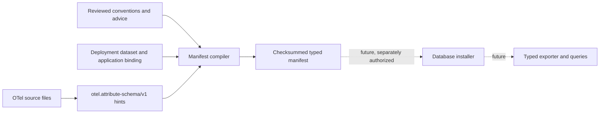

# Typed attribute manifests

OpenTelemetry attributes keep their real values in the SDK, but ClickStack's
compatible attribute maps store text. Text maps are useful for broad search and
compatibility; they are awkward for numeric filters and aggregates. Frequently
queried attributes can eventually be copied into dedicated typed columns while
the existing text entry remains available.

This release provides the safe first step: a pure manifest compiler. It does not
connect to chDB, run DDL, inspect stored telemetry, or change exporter rows.



## Compile a manifest

The deployment supplies the dataset and application identity. These values are
trusted configuration; an OTel `schemaUrl`, attribute value, or runtime
observation cannot choose them.

```clojure
(require '[otel.exporter.chdb.attribute-manifest :as manifest])

(def compiled
  (manifest/compile-manifest
   {:dataset-id "telemetry-prod"
    :application-id "checkout"
    :lineage "checkout-v1"
    :version 1
    :fragments
    [{:schema manifest/reviewed-fragment-schema
      :authority :advice
      :source "instrumentation/checkout.edn"
      :entries
      [{:location :span-attributes
        :key "checkout.remaining_items"
        :type :int64}
       {:location :span-attributes
        :key "checkout.complete"
        :type :boolean}]}]}))

(spit "target/checkout-attributes.edn" (manifest/render compiled))
```

The first format accepts three promoted types: `:string`, `:boolean`, and
`:int64`. They map only to the library-owned ClickHouse types `String`, `Bool`,
and `Int64`. Callers cannot supply SQL, codecs, column names, or type
expressions.

Reviewed fragments use one of three authorities:

- `:semantic-convention` for a pinned convention registry;
- `:advice` for an instrumentation or advice pack;
- `:runtime-reviewed` for an observation that an operator has explicitly
  reviewed and converted into configuration.

The supported locations are span, resource, scope, log, and metric-point
attributes. Source-inferred fragments currently cover the locations emitted by
`otel.attribute-schema/v1`; reviewed fragments can describe scope attributes as
well.

## Determinism and conflicts

Fragment, map, and entry traversal order cannot change the result. Identical
declarations merge their provenance. Different reviewed types for the same
location and key fail compilation; `:int64` is never widened to `:double`.

Every field identity includes the dataset, application, lineage, version,
location, key, and type. Its value and status column names contain a bounded
readable prefix plus a digest suffix, so two keys that sanitize to the same text
still receive different identifiers. The manifest checksum is SHA-256 over its
canonical EDN payload without the checksum field. Rendering adds one final
newline and no timestamp or checkout path.

Inference is evidence, not permission. Unknown expressions, invalid literals,
conflicting types, unsupported values, and dynamic keys become explicit
diagnostics and do not produce fields. A reviewed fragment may promote a safe
declaration separately; inference cannot silently override it.

## What remains

A later slice will persist manifests and install their columns through an
explicit state machine. Only an active persisted descriptor should become
queryable. That work must distinguish historical-untyped, absent,
present-empty, valid, and invalid row states, reconcile interrupted DDL, and
prove direct-export and OTLP-receiver equivalence. None of those database or
ingestion claims are made by this compiler-only release.
